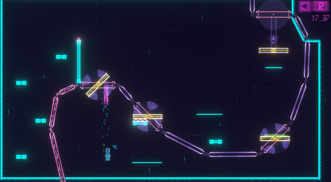
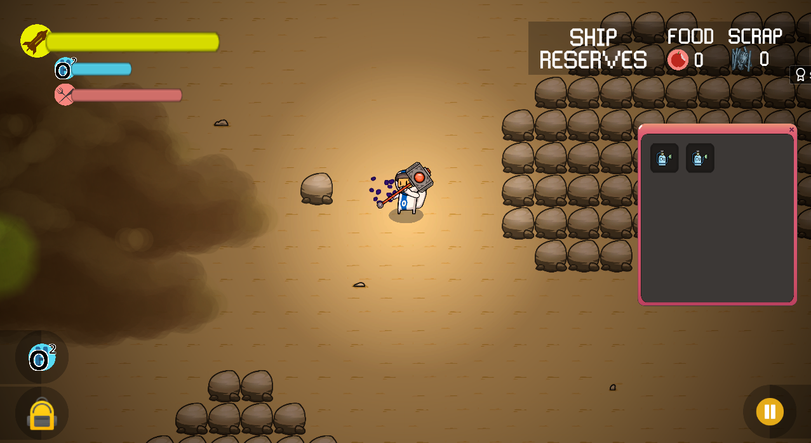
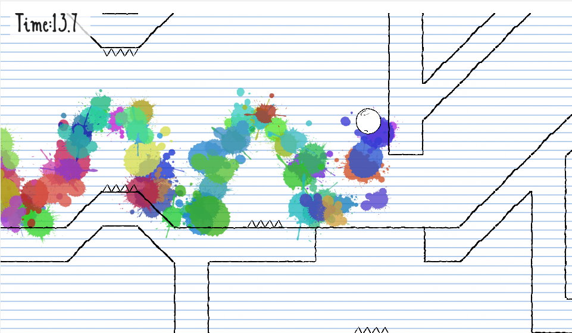
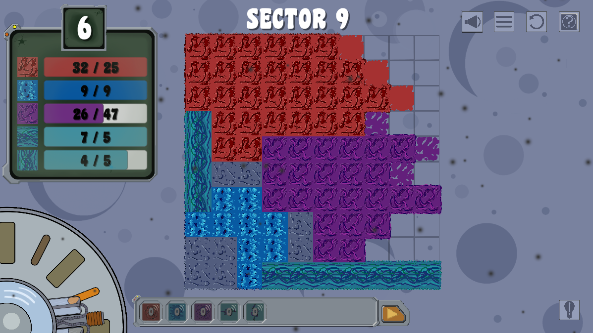

# Colaboration Projects

Below is an external list of projects I collaborated on after graduation

## Project List

### PatchDroid

[Repo link](https://github.com/ArtomD/Game-Off-2021-11)  
[Demo link](https://crankky.itch.io/pathdroid)  

Language C# in Unity

2D Platformer created for the [Game Off 2021 game jam](https://itch.io/jam/game-off-2021), with an overal place of 10th. (1 month of development)

### Sandmageddon

[Repo link](https://github.com/corynorris/brackeys-2021.2)  
[Demo link](https://crankky.itch.io/sandmageddon)  

Language C# in Unity

2D Top down survival crafter created for [Brackeys Game Jam 2021.2](https://itch.io/jam/brackeys-6), with an overal place of 512th. (1 week of development)

### We-Roll

[Repo link](https://github.com/ArtomD/GameJam2021)  
[Demo link](https://crankky.itch.io/we-roll)  

Language C# in Unity

2D platformer with multiplayer elements created for [GMTK Game Jam 2021](https://itch.io/jam/gmtk-2021), with an overal place of 364th. (2 days of development)

### Goona

[Repo link](https://github.com/corynorris/gameoff-2020)  
[Demo link](https://corynorris.github.io/gameoff-2020/)  

Language C# in Unity

2D real time puzzle game created for [Game Off 2020](https://itch.io/jam/game-off-2020), with an overal place of 36th. (1 month of development)

# PersonalProjects

The following is a compilation of projects completed by me during my CPA course in Fanshawe.

## Project List

### Kartau

[Repo link](https://github.com/ArtomD/Kartau)

Language: Java

Android application that uses the Google Maps API to let users share their location with select groups

### Curbby-ui

[Repo link](https://github.com/ArtomD/curbby-ui)

Language: JavaScript

Interface for Curbby, a shoppify addon that lets buisness coordinate pickup locations with customers.

### AndroidGMaps

[Repo link](https://github.com/ArtomD/PersonalProjects/blob/master/AndroidGMaps)

Language: Java

Android application that uses the Google Maps API to track and store user locations.

### BatcherLauncher

[Repo link](https://github.com/ArtomD/PersonalProjects/blob/master/BatcherLauncher)

Language: C++

C++ application that launches a list of files asynchronously in separate groups or batches.

### CurrencyConverter

[Repo link](https://github.com/ArtomD/PersonalProjects/blob/master/CurrencyConverter)

Language: Java

Android application that compares different world currency with additional image recognition for some select bills.

### GoFish

[Repo link](https://github.com/ArtomD/PersonalProjects/blob/master/GoFish)

Language: C#

C# server and client application used to host and play a game of Go Fish.

### Gomoku

[Repo link](https://github.com/ArtomD/PersonalProjects/blob/master/Gomoku)

Language: C++

C++ console application that creates a multi-view interface in which two players can play Gomoku.

### LiteBrite

[Repo link](https://github.com/ArtomD/PersonalProjects/blob/master/LiteBrite)

Language: C#

A WPF application that lets users create colorful mosaics with tiles.

### MultithreadGrep

[Repo link](https://github.com/ArtomD/PersonalProjects/tree/master/MultithreadGrep)

Language: C++

A C++ console application to search for files containing specific regex.

### SocketedGrep

[Repo link](https://github.com/ArtomD/PersonalProjects/tree/master/SocketedGrep)

Language: C++

Uses the above MultithreadGrep application and adapts it to communicate as a server/client application via sockets.

### TiltShip

[Repo link](https://github.com/ArtomD/PersonalProjects/tree/master/TiltShip)

Language: C#

A Unity game aimed to be deployed on Android that lets users play a modern take on the Asteroids game.

### TiltShip

[Repo link](https://github.com/ArtomD/PersonalProjects/tree/master/MERN)

Language: Javascript(React/Node.Js)

A simple app with a React front end and a Node.Js backend with mongodb and express
